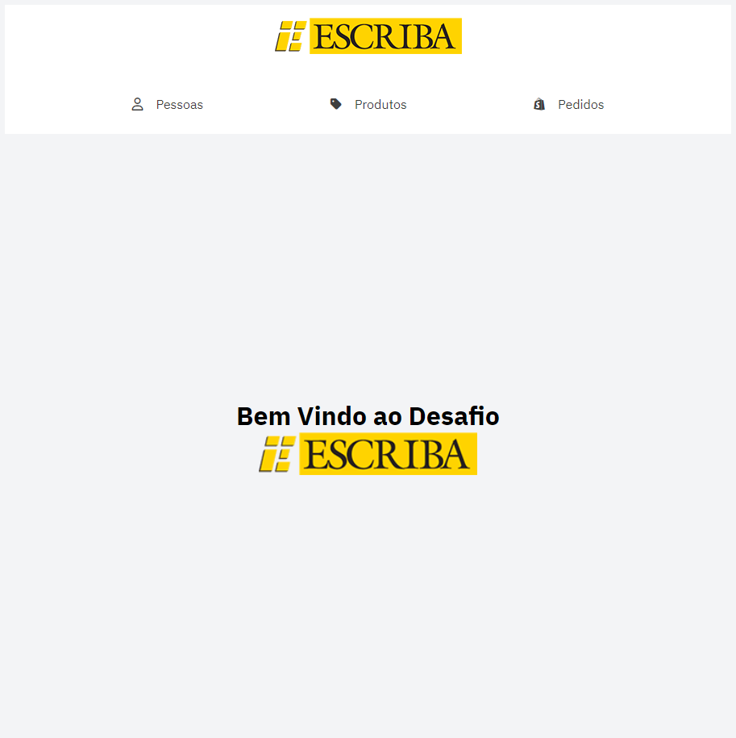
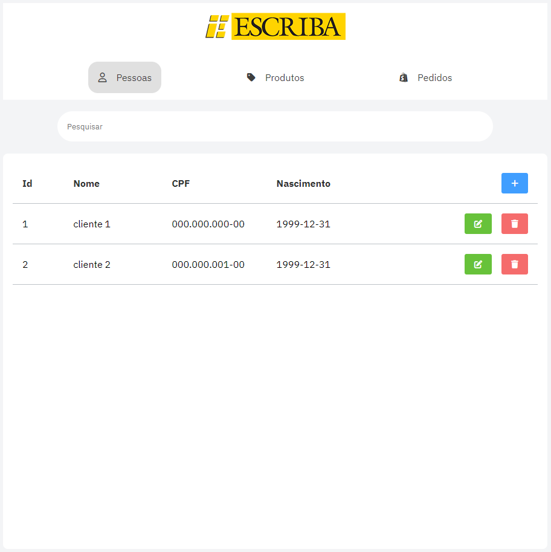
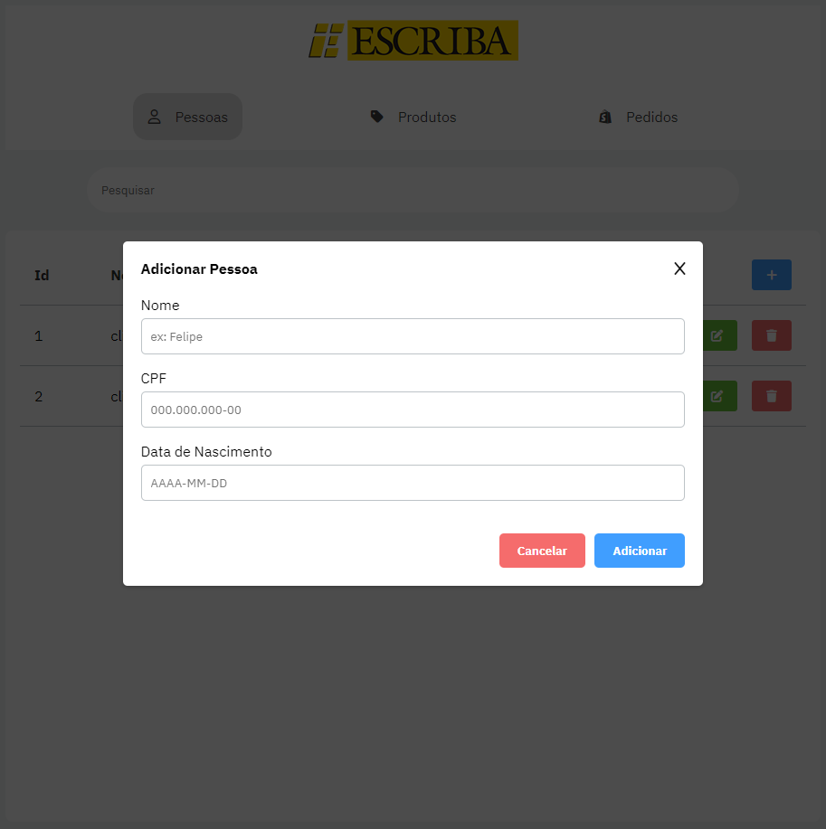
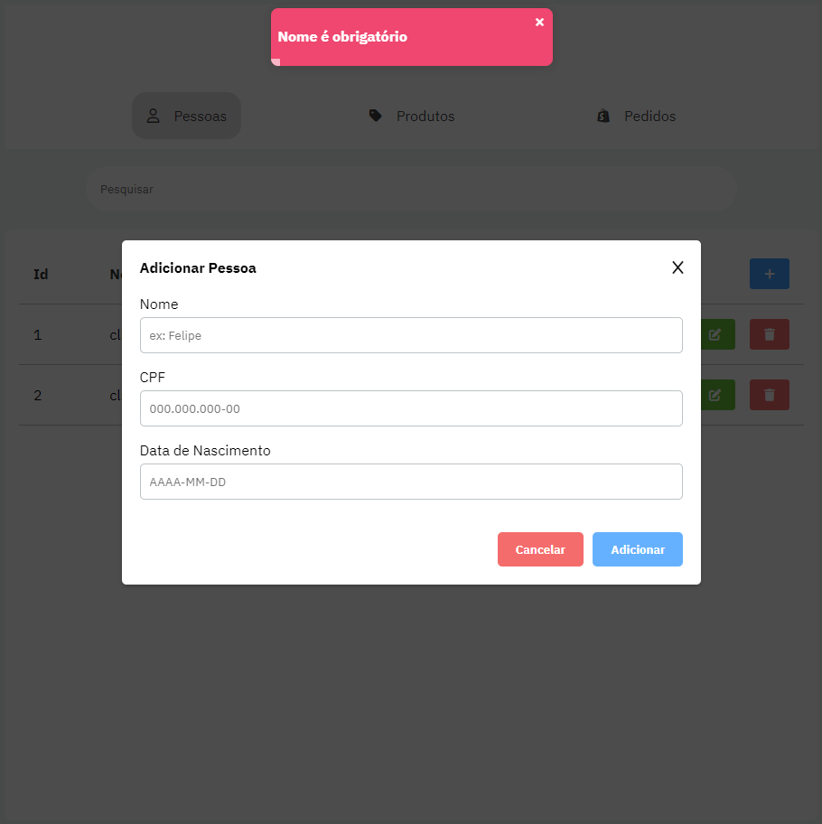
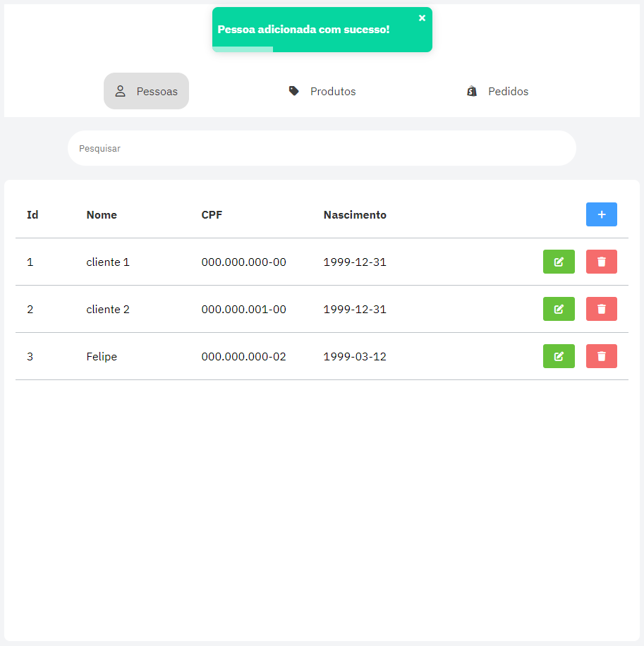
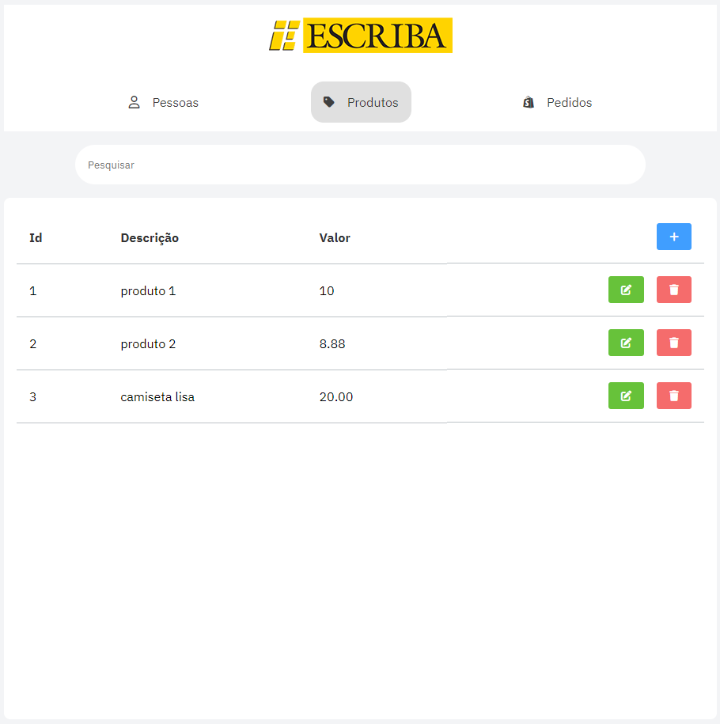
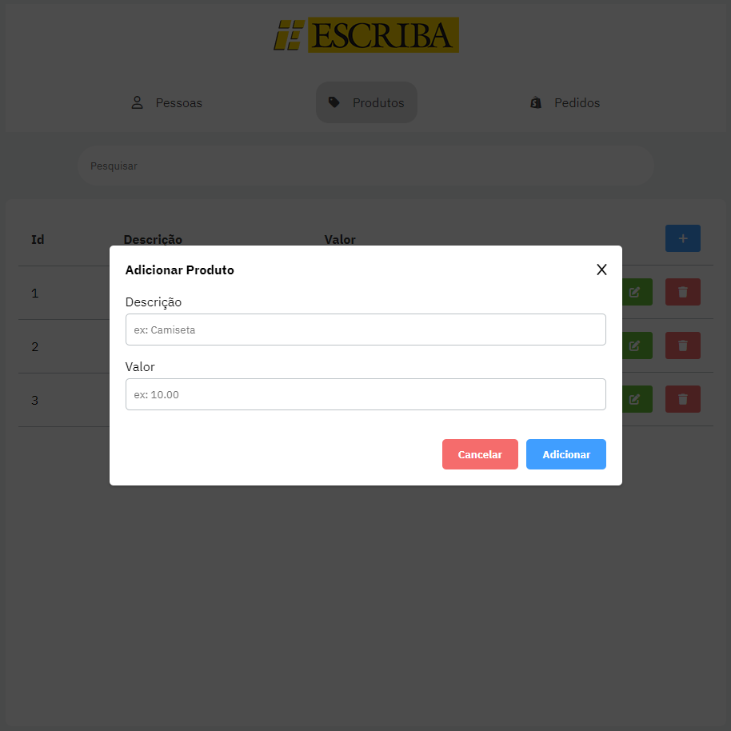
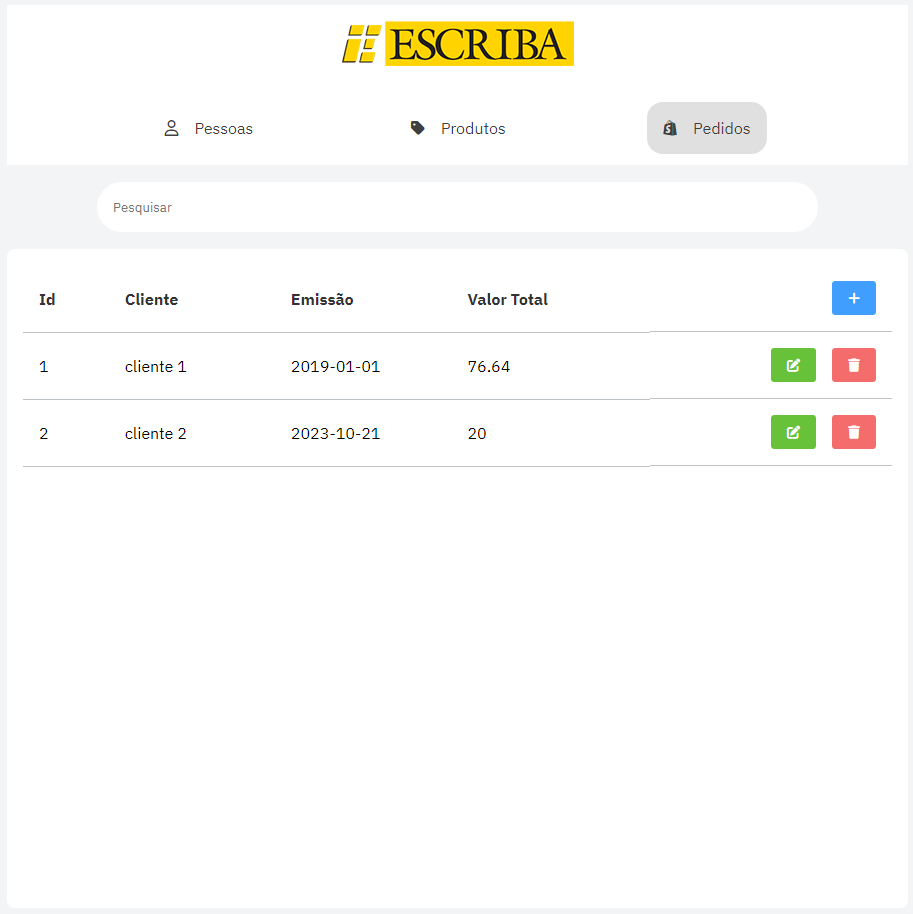
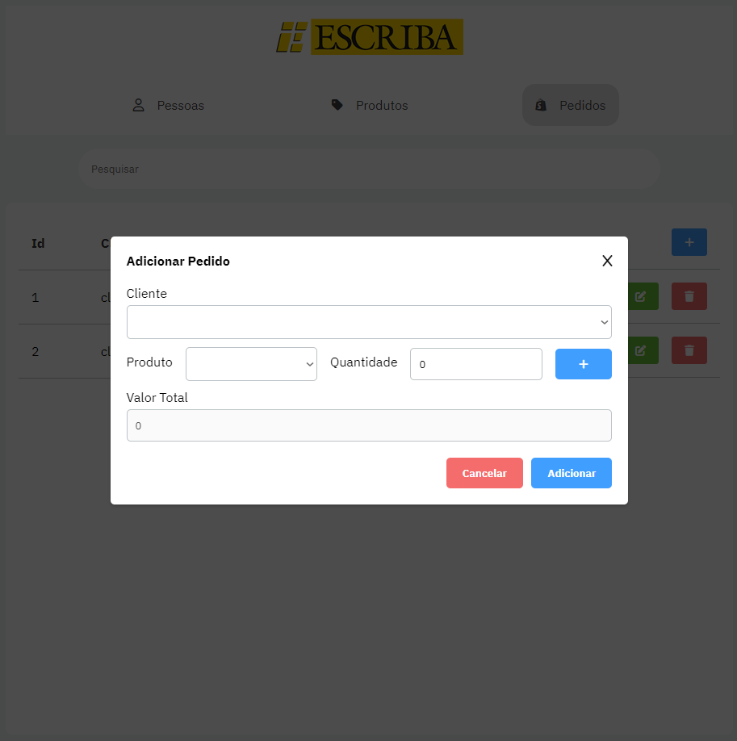
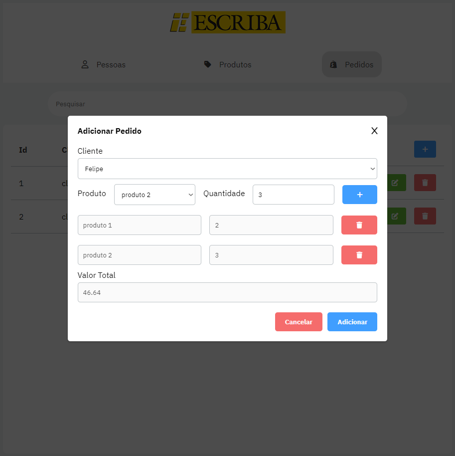

## Desafio Escriba

### Sobre o Projeto

Este projeto representa a minha contribuição durante o processo seletivo da empresa Escriba. Trata-se de uma aplicação de front-end que consome a API Restful detalhada nos requisitos técnicos da atividade. Com esta aplicação, é possível realizar cadastros de pessoas, produtos e pedidos.

### Tecnologias Utilizadas

Conforme solicitado nas instruções da atividade, optei por utilizar o Vue.js como o principal framework para o desenvolvimento, em conjunto com o SCSS para a estilização. Além disso, fiz uso da biblioteca Axios para realizar as requisições à API, Vue Router para configuração das rotas e Vuex para o gerenciamento de estados. Importante mencionar que, embora não fosse exigido pela atividade, optei por não utilizar nenhuma biblioteca de componentização como Element Plus ou similares.

### Como Executar o Projeto

#### Serviço (API):

Para executar o serviço de backend, é necessário seguir os seguintes passos:

1. Instale o `json-server` globalmente, caso ainda não o tenha feito:

```shell
npm install -g json-server
```

2. Execute o comando abaixo para inicializar o servidor utilizando o arquivo `data.json` disponibilizado pela atividade:

```shell
json-server --watch data.json
```

#### Frontend (Aplicação Vue.js):

Para executar o frontend da aplicação, siga os passos abaixo:

1. Certifique-se de que todas as dependências estejam instaladas executando o seguinte comando na raiz do projeto:

```shell
yarn
```

2. Inicie a aplicação Vue.js com o seguinte comando:

```shell
yarn dev
```

Após seguir essas etapas, o projeto estará em execução e você poderá acessá-lo em seu navegador. Lembre-se de que é necessário ter tanto o serviço de backend quanto o frontend em execução para usar a aplicação corretamente.

### Layout









